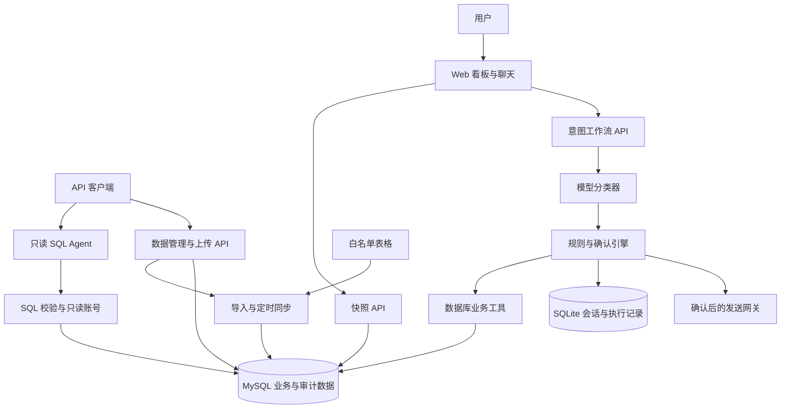

# ThreadPilot

基于 FastAPI、MySQL 和 OpenAI 兼容模型接口的工厂订单与运营助手，通过意图工作流与只读 SQL Agent 提供可追溯的业务问答。

快速导航：[环境准备](#6-环境准备) · [操作步骤](#7-详细操作步骤) · [实现与接口](#8-功能实现说明) · [配置](#10-配置项参考) · [测试](#11-测试方法) · [排错](#12-常见问题与排错)

已完成首次配置和数据库初始化时，确认 MySQL 服务正在运行，然后在项目根目录启动：

```powershell
# Windows PowerShell
./backend/start.ps1
```

```sh
# macOS / Linux
sh backend/start.sh
```

打开 <http://127.0.0.1:8000>。`MYSQL_APP_PASSWORD`、`MYSQL_AI_PASSWORD` 和 `DATA_API_TOKEN` 保存于本机 `backend/.env`，无需每次启动重新输入。首次部署请按第 6、7 节完成依赖安装、配置和初始化。

## 1. 项目简介

ThreadPilot 面向订单跟进、生产异常分析和日常执行管理。Web 页面由后端同源托管，业务数据存储于 MySQL，会话与确认记录存储于 SQLite。

本文适用 API **2.0.0**；Python 包元数据版本为 **1.0.0**，两者不是同一版本字段。完整参考见 [文档索引](docs/README.md)。

## 2. 项目背景与目标

表格能够记录订单和产量，但难以支持持续更新、多轮查询和执行审计。将整份表格放入模型上下文还可能产生过时答案、模糊订单误选和无依据解释。

ThreadPilot 将表格导入结构化数据库，每轮业务查询读取最新已提交记录。模型提取意图和槽位，程序处理澄清、业务规则和确认；临时分析通过受限 SQL 查询完成。回复附带记录、来源、版本或实际执行 SQL，便于核对。

“最新数据”指数据库已提交的数据；文件尚未同步或上游尚未录入的事件不属于查询结果。

## 3. 核心功能

- **订单定位与刷新**：依据客户、产品和订单号筛选候选；多候选先追问，代词关联 active_order，并通过数据库工具刷新字段。
- **风险、比较与承诺评估**：用明确的日期、闲置阈值、产能基线和情景假设解释结果，区分已发生事实与预测，不使用黑盒优先级分数。
- **运营分析**：使用历史同星期基线判断阶段产出，展示共现记录及数据缺口，不将单次低值或共现关系视为故障或因果证明。
- **受控业务执行**：催办、备注和条件提醒先预览再确认；SQLite 保存状态与幂等记录，发送依赖外部 webhook 网关。
- **表格导入与增量同步**：pandas/openpyxl 清洗 XLSX/CSV，按业务键和哈希导入；APScheduler 定时检查白名单文件，冲突回滚而非覆盖 API 修改。
- **数据管理**：FastAPI + SQLAlchemy 提供 CRUD、版本校验、同步审计和稳定记录证据链接。
- **只读 SQL 问答**：LangChain SQLDatabaseToolkit 配合独立 SELECT-only 账号、SQL AST 校验、限行和超时，返回答案及实际查询结果。
- **动态看板与聊天**：页面通过 `/api/snapshot` 加载数据；聊天使用 SSE，在服务端完成验证后返回完整答案。看板刷新与聊天查询相互独立。

业务范围包含 1.1–1.6、2.1–2.2、3.1–3.3 共 11 个子场景，详见 [意图工作流](docs/INTENT_WORKFLOW.md)。

## 4. 技术栈与依赖

| 类别 | 版本要求 / 依赖 | 用途 |
|---|---|---|
| Python | 3.12 或 3.13 | 后端运行时，项目要求 `>=3.12,<3.14` |
| HTTP 服务 | FastAPI `>=0.121,<1`；Uvicorn `>=0.34,<1` | API、生命周期和静态页面 |
| 数据校验 | Pydantic `>=2,<3`；pydantic-settings `>=2.10,<3` | 输入、结构化输出和环境配置 |
| 数据库 | MySQL 8.x | 业务数据和同步审计 |
| ORM / 迁移 | SQLAlchemy `>=2.0,<3`；Alembic `>=1.16,<2`；PyMySQL `>=1.1,<2` | 事务、连接和结构迁移 |
| 表格 | pandas `>=2.2,<3`；openpyxl `>=3.1,<4` | 清洗与导入 |
| 调度 | APScheduler `>=3.11,<4` | 文件轮询同步 |
| 模型调用 | openai `>=2,<3` | 意图提取 |
| SQL Agent | LangChain `>=1,<2`；langchain-community `>=0.4,<0.5`；langchain-openai `>=1,<2` | 工具调用与只读分析 |
| SQL 校验 | sqlglot `>=27,<29` | SELECT 白名单和 AST 检查 |
| 前端 | 原生 HTML / CSS / JavaScript | 无前端构建步骤 |
| 测试 | pytest `>=8,<10`；HTTPX；Playwright | 后端与浏览器回归 |

具体依赖范围见 [pyproject.toml](backend/pyproject.toml)，锁定版本见 [uv.lock](backend/uv.lock)。本机开发统一使用 uv.lock 安装依赖。

## 5. 项目目录

```text
threadpilot/
├── frontend/                     # FastAPI 托管的 Web 客户端
│   ├── index.html                # 页面入口
│   ├── app.js                    # 导航、页面状态和本地交互
│   ├── data.js                   # 请求 /api/snapshot 后加载页面模块
│   ├── data-views.js              # 订单、产出与外协厂视图
│   ├── ai-api.js                  # 聊天渲染与共用状态
│   ├── ai-stream.js               # SSE、停止、重试与会话切换
│   └── workspace.js               # 工作台布局、导航、逐轮证据与对话导出
├── backend/
│   ├── app/
│   │   ├── main.py               # 应用入口、生命周期与路由注册
│   │   ├── config.py             # 环境配置与默认值
│   │   ├── schemas.py            # 意图、槽位、状态及聊天契约
│   │   ├── intent_classifier.py  # 模型提示词与结构化意图提取
│   │   ├── workflow_engine.py    # 路由、澄清、业务规则与确认
│   │   ├── workflow_tools.py     # 风险、产能及运营计算
│   │   ├── workflow_store.py     # SQLite 会话与执行审计
│   │   ├── workflow_api.py       # JSON/SSE、回复与通知入口
│   │   ├── db/                   # SQLAlchemy Base、engine 和 Session
│   │   ├── models/               # 业务表、同步审计与删除标记
│   │   ├── schemas_db/           # 数据管理接口校验模型
│   │   ├── crud/                 # 数据集注册、业务键与记录转换
│   │   ├── services/             # 导入、同步、快照、SQL Agent
│   │   └── api/                  # 数据、同步、快照与 SQL 问答路由
│   ├── scripts/                  # 初始化、授权、快照、OpenAPI 与评测
│   ├── tests/                    # 工作流、数据链路与 MySQL 测试
│   ├── runtime/                  # 私有 SQLite 和运行报告，不提交 Git
│   ├── start.ps1                 # Windows 本机启动脚本
│   ├── start.sh                  # macOS/Linux 本机启动脚本
│   ├── .env.example              # 本机后端配置模板
│   ├── alembic.ini               # 迁移入口配置
│   ├── pyproject.toml             # Python 依赖与开发依赖组
│   └── uv.lock                   # 锁定的 Python 依赖
├── data/
│   ├── orders.csv                # 订单种子及回归基准
│   ├── production_log.csv        # 阶段产出种子
│   ├── workshops.csv             # 外协厂种子
│   ├── dialogs.xlsx              # 对话验收输入，示例答案不是事实来源
│   ├── raw/                      # 待导入原始文件，内容不提交 Git
│   ├── staging/                  # 中间数据预留目录，导入不依赖它
│   ├── dictionary/               # 字段定义和列名映射
│   ├── scenarios/                # 场景输入说明
│   ├── snapshots/                # 离线导出 JSON，在线服务不读取
│   └── migrations/               # Alembic env.py 与版本脚本
├── docs/                         # 用户手册、设计、OpenAPI 与验证报告
├── tests/e2e/                    # Playwright 模拟服务回归
└── CONTRIBUTING.md               # 代码评审与维护约定
```

## 6. 环境准备

开发环境使用本机 Python、uv 和 MySQL。

| 工具 | 要求 |
|---|---|
| Python | 3.12 或 3.13 |
| uv | 可执行 uv sync --locked 的版本 |
| MySQL | 8.x，服务已启动，准备具有建库和授权权限的本机管理员账号 |
| Git | 用于获取代码和版本管理 |
| Node.js / Microsoft Edge | 可选，仅浏览器回归需要 |

Windows PowerShell 检查：

```powershell
python --version
uv --version
mysql --version
Get-Service *mysql*
```

macOS / Linux 检查：

```sh
python3 --version
uv --version
mysql --version
```

MySQL 服务的启动方式取决于安装方式；先确认能够使用管理员账号登录本机 MySQL。客户端版本输出不表示服务已启动。默认数据库端口为3306，后端为8000；如果占用，按第12节处理。若此前运行过容器或其他后端，先停止对应服务或使用不同端口。切换到本机不会自动迁移容器中的业务数据或 SQLite 会话；需要这些数据时先备份并单独迁移。macOS/Linux 的密码输入示例使用 bash。

## 7. 详细操作步骤

### 7.1 克隆或下载

三个系统均可执行：

```sh
git clone https://github.com/jingweiluo557/DSS5105.git
cd DSS5105/threadpilot
```

下载 ZIP 时解压后进入包含 `backend/` 和 `frontend/` 的 `threadpilot` 目录。下文称此位置为“项目根目录”。

### 7.2 安装依赖

安装 Python、uv 和 MySQL 后执行下列命令；Windows PowerShell、macOS/Linux 相同：

```sh
python --version
uv --version
cd backend
uv sync --locked --group dev
```

macOS/Linux 如果没有 `python` 命令，可用 `python3 --version` 检查。使用 `uv run` 无需手动激活虚拟环境。本机 MySQL 安装完成后，需准备可建库、建用户、授权及执行迁移的部署账号。

### 7.3 首次配置：保存一次，后续自动读取

应用配置统一编辑 **`backend/.env`**。根目录 `.env` 不参与本机启动。操作系统环境变量优先于 dotenv；排查配置不生效时检查终端中同名变量。

接着上一步，在 **backend 目录**复制模板，已存在的文件不覆盖；已有可用配置时保留原值：

Windows：

```powershell
if (-not (Test-Path .env)) { Copy-Item .env.example .env }
notepad .env
```

macOS / Linux：

```sh
[ -f .env ] || cp .env.example .env
# 用文本编辑器编辑 .env
```

仅在首次配置且没有现成凭据时，生成应用账号、只读账号密码和管理令牌（已有 MySQL 的 root 密码不能随机替换）：

```sh
python -c "import secrets; names=['MYSQL_APP_PASSWORD','MYSQL_AI_PASSWORD','DATA_API_TOKEN']; print('\n'.join(n+'='+secrets.token_hex(24) for n in names))"
```

**命令只打印配置，不自动写文件。** 将这三个值保存到 backend/.env，应用和 AI 密码也分别填入两个连接 URL；后续自动读取，不需要每次重新生成或设置。不要将管理员密码长期写入应用配置。应用与 AI 密码须为 24–128 位字母、数字、`_` 或 `-`，不可使用 `replace_` 占位值；三个数据库密码必须不同。生成值为 48 位十六进制字符。模型密钥必须填写有效服务密钥，不能随机生成。

| 变量 | 含义 | 示例 | 是否必填 |
|---|---|---|---|
| MYSQL_ROOT_PASSWORD | 初始化时使用的管理员密码 | 已有本机 MySQL 的 root 密码 | provision 必填，仅终端临时设置 |
| MYSQL_APP_PASSWORD | 业务账号密码 | 另一个 48 位值 | provision 必填，保存到 backend/.env |
| MYSQL_AI_PASSWORD | AI 只读账号密码 | 第三个 48 位值 | provision 必填，保存到 backend/.env |
| DATA_API_TOKEN | 管理写入与同步审计令牌 | 独立随机令牌 | 管理功能必填 |
| DATABASE_URL | 本机应用数据库连接 | `mysql+pymysql://threadpilot_app:密码@127.0.0.1:3306/threadpilot?charset=utf8mb4` | 必填 |
| AI_DATABASE_URL | 本机独立只读连接 | `mysql+pymysql://threadpilot_ai:密码@127.0.0.1:3306/threadpilot?charset=utf8mb4` | SQL Agent 必填 |
| OPENAI_API_KEY | 模型服务密钥 | 服务商发放的实际密钥 | AI 功能必填 |
| OPENAI_BASE_URL | 模型接口地址 | `https://api.openai.com/v1` | 兼容服务必填；官方服务可使用模板值 |
| OPENAI_MODEL | 可访问的模型标识 | `gpt-4.1` | 可用默认值，须具备访问权限 |
| INTENT_API_STYLE | 意图调用协议 | `responses` / `chat_completions` | 可用默认值 |
| MYSQL_PORT | 初始化脚本连接本机 MySQL 的端口 | `3306` | 可选；须与两个连接 URL 一致 |

其他变量及默认值见第 10 节。兼容网关的意图接口可选择 Chat Completions JSON mode；SQL Agent 还要求 tool calling。无模型密钥时可使用数据导入、CRUD 和快照，AI 功能不可用。

配置示例见 [backend/.env.example](backend/.env.example)。DATABASE_URL 使用业务读写账号，AI_DATABASE_URL 使用独立只读账号，不能让模型连接 root。真实 .env 不提交 Git。

配置读取关系如下：

| 使用场景 | 自动读取的配置 | 说明 |
|---|---|---|
| 数据库初始化 `scripts.provision_mysql` | `backend/.env` 中的 `MYSQL_*` | 已设置的终端变量优先；设置账号密码与权限 |
| 后端日常启动 | `backend/.env` 中的 `DATABASE_URL`、`AI_DATABASE_URL`、`DATA_API_TOKEN` 等 | 通过两个 URL 连接数据库，保留管理接口令牌校验 |
| Docker Compose | 项目根目录 `.env` | 与本机后端配置分开维护 |

本机后端不会根据 `MYSQL_APP_PASSWORD` 或 `MYSQL_AI_PASSWORD` 自动重写连接 URL。修改密码时，需要同步修改对应 URL，并通过初始化脚本将新密码应用到数据库；只修改配置文件不会改变 MySQL 中的密码。日常启动无需执行这些操作。

### 7.4 初始化数据库与数据

在 backend 目录执行。

先将 `MYSQL_APP_PASSWORD`、`MYSQL_AI_PASSWORD`、`DATA_API_TOKEN` 保存到 `backend/.env`，应用和 AI 密码必须与文件中的两个连接 URL 一致。保存一次后，初始化脚本和后端启动会自动读取，无需每次设置这三个终端变量。已有终端变量优先于文件配置。初始化仅首次部署或迁移时执行，日常直接运行启动脚本即可。

Windows：

```powershell
$env:MYSQL_HOST = '127.0.0.1'
$env:MYSQL_PORT = '3306'
$env:MYSQL_DATABASE = 'threadpilot'
$env:MYSQL_ROOT_PASSWORD = Read-Host '请输入现有 MySQL root 密码' -MaskInput
uv run python -m scripts.provision_mysql
Remove-Item Env:MYSQL_ROOT_PASSWORD
```

macOS / Linux：

```sh
export MYSQL_HOST=127.0.0.1 MYSQL_PORT=3306 MYSQL_DATABASE=threadpilot
read -r -s -p 'MySQL root password: ' MYSQL_ROOT_PASSWORD; echo
export MYSQL_ROOT_PASSWORD
uv run python -m scripts.provision_mysql
unset MYSQL_ROOT_PASSWORD
```

Windows 上的 `-MaskInput` 需要 PowerShell 7.1 或更高版本。Windows PowerShell 5.1 可使用 `$credential = Get-Credential -UserName root -Message 'MySQL 初始化凭据'`，再执行 `$env:MYSQL_ROOT_PASSWORD = $credential.GetNetworkCredential().Password`。

以上 Unix 密码输入片段请在 **bash** 中执行（macOS 可先输入 `bash`）；不要将新随机值当作已有 root 密码。脚本会对指定库执行迁移，并设置应用和 AI 用户的密码与权限；也可由 DBA 完成等效建库、迁移与最小权限授权。

初始化成功的日志为 `Migrations and separate application/SELECT-only accounts are ready.`。随后导入种子：

```sh
uv run python -m scripts.init_db --skip-migrate --seed-existing
```

首次导入预期三条 status=success，插入数量为120个订单、360条产出和8家外协厂。重复导入按业务键和哈希处理。应用账号不具备建表权限，因此导入使用 --skip-migrate；结构迁移由上一部署步骤完成。

**导入自己的表格**：XLSX 推荐使用 `orders`、`production_log`、`workshops` 三个 sheet，列定义见 [schema.yaml](data/dictionary/schema.yaml)，别名见 [field_mapping.yaml](data/dictionary/field_mapping.yaml)。在 backend 中执行：

```sh
uv run python -m scripts.make_sample_workbook
uv run python -m scripts.init_db --skip-migrate --file ../data/raw/source.xlsx
```

示例文件基于仓库种子生成，已存在时拒绝覆盖。不传 `--file` 时依次查找 `data/raw/source.xlsx` 和 `data/source.xlsx`。单 sheet 可用 `--dataset orders` 指定表；多表文件整体事务提交。也可使用第8节上传接口导入文件。

### 7.5 启动：开发与部署模式

首次初始化完成后，每次只需确认 MySQL 服务运行，再使用启动脚本。无需重新生成密码、设置三个终端变量或重复导入种子数据。关闭后端后，`backend/.env` 中的配置会保留；重新启动时自动读取。

本机开发在 backend 执行：

```sh
uv run uvicorn app.main:app --host 127.0.0.1 --port 8000 --reload
```

本机部署模式（不使用 reload）：

```sh
uv run uvicorn app.main:app --host 0.0.0.0 --port 8000 --workers 1
```

也可以在 backend 目录使用启动脚本：

Windows：

```powershell
./start.ps1 -Reload
```

macOS / Linux：

```sh
sh start.sh --reload
```

脚本使用锁定依赖，默认监听127.0.0.1:8000。它不会创建配置、初始化数据库或导入数据；缺少 backend/.env 时会提示先完成配置。Windows 可用 -Port 8001，Unix 可用 --port 8001。部署模式保持单个 worker，不使用 reload；见第13节。

### 7.6 验证运行成功

默认访问地址：

- 页面：<http://127.0.0.1:8000>
- Swagger：<http://127.0.0.1:8000/docs>
- ReDoc：<http://127.0.0.1:8000/redoc>
- 健康接口：<http://127.0.0.1:8000/api/v1/health>
- 数据快照：<http://127.0.0.1:8000/api/snapshot>

Windows：

```powershell
Invoke-RestMethod http://127.0.0.1:8000/api/v1/health
$snapshot = Invoke-RestMethod http://127.0.0.1:8000/api/snapshot
$snapshot.orders.Count
$snapshot.production_log.Count
$snapshot.workshops.Count
```

macOS / Linux：

```sh
curl -f http://127.0.0.1:8000/api/v1/health
curl -f http://127.0.0.1:8000/api/snapshot
```

健康接口预期 `status: ok`；`configured` 只表示模型客户端已配置，不证明密钥有效、额度充足或数据库可用。快照预期含 `today`、`generated_at` 和三张表；初始数量为 120/360/8，运行后以数据库为准。后端日志通常包含 `Application startup complete`，初始化成功包含 `Migrations and separate application/SELECT-only accounts are ready.`。

真实问答可在页面输入 `Open ORD-005`；检查回复与证据，而不是只看 HTTP 200。发送、备注、提醒仍须确认。

## 8. 功能实现说明

### 8.1 架构与模块

Web 主导航为 Dashboard、AI workspace、Activity Log 和 Settings；订单、异常、风险、可行性及 Watches & receipts 通过工作台工具栏访问。AI 工作台集中展示快照摘要、日报入口、当前对话记录和数据库证据；Activity Log 展示浏览器本地操作，Settings 管理本地偏好。路由与状态边界见 [前端说明](frontend/README_ZH.md)，操作步骤见 [用户手册](docs/USER_MANUAL.md)。



| 模块 / 职责 | 关键文件与入口 | 实现思路 | 输入 → 输出 |
|---|---|---|---|
| 应用与数据库生命周期 | app/main.py、config.py；db/session.py 的 Database、get_session | 创建连接资源，依赖注入 Session，提交或回滚后关闭 | 环境配置 / HTTP → 路由结果 |
| 意图分类 | intent_classifier.py 的 IntentClassifier.classify | 独立提示词、结构化模型输出、Pydantic 校验 | 消息、状态、业务时间 → 分类与槽位 |
| 工作流编排 | workflow_engine.py 的 WorkflowEngine.chat、route、confirm | 合并状态、最小澄清、读取事实、预览及确认校验 | ChatRequest → ChatResponse |
| 业务事实与计算 | workflow_tools.py；services/snapshot_service.py 的 DatabaseDataTools | 每次调用读取数据库，确定性规则生成风险与估算 | 订单 / 日期 / 产能槽位 → 事实、解释、证据 |
| 状态及执行审计 | workflow_store.py 的 WorkflowStore；workflow_api.py | SQLite 持久化与幂等确认、条件提醒轮询 | 会话 / 操作 / 回复事件 → 状态、审计、通知 |
| 导入和同步 | importer.py 的 parse_file、import_bytes；sync_service.py 的 SyncService.check | 业务键、哈希、文件基线和事务冲突检测 | 文件字节或白名单路径 → SyncRead |
| 看板快照 | snapshot_service.py 的 snapshot；frontend/data.js | 请求时查询 MySQL，页面刷新获取快照 | 业务日期 → 三表 JSON |
| SQL 分析 | ai_sql_service.py 的 AISQLService.ask、validate_sql | 独立会话，模型生成受限查询，记录实际 SQL | message、session_id → answer、queries |

表中的 Python 文件位于 `backend/app/`，服务文件位于其 `services/`。分类模型不能直接授予写权限；订单在预览后变化会使确认失效。风险标签不等于确认延迟，产能结果是含假设估算。

SQL Agent 让数据库执行筛选和聚合，减少整表上下文及过时快照。只读保障包括独立 MySQL SELECT 授权、单条 SELECT AST 校验、表/函数白名单、LIMIT、超时和只读事务。CTE、UNION、注释、系统库、DML/DDL 等超出允许子集的 SQL 会被拒绝。

增量同步只处理文件变化：输入哈希不变时跳过；文件和数据库同时改变同一记录时冲突回滚；缺行不等于删除；显式删除留下墓碑，旧文件不会自动恢复。`SYNC_FILES` 为白名单，不扫描其他工作簿。

浏览器本地 Add note、Watch、模拟发送和偏好独立于服务端状态；它们不自动写入 MySQL 或工作流 SQLite。服务端执行使用聊天工作流，数据维护使用管理 API。

### 8.2 API 接口表

默认 Base URL 为 `http://127.0.0.1:8000`。JSON 请求使用 `Content-Type: application/json`，文件上传使用 multipart。完整字段及错误契约见 [API 文档](backend/API_DOCUMENTATION.md) 和 [OpenAPI](docs/openapi.json)。

| 方法 | 路径 | 主要参数 | 返回 | 示例 |
|---|---|---|---|---|
| GET | /api/v1/health | 无 | 状态、模型配置标记 | `/api/v1/health` |
| POST | /chat | message、可选 session_id / confirmation_id | ChatResponse，含澄清、工具和证据 | `{"message":"Open ORD-005"}` |
| POST | /api/v1/workflow/chat | 同 /chat | 同 /chat | `{"message":"Refresh this order","session_id":"服务器返回的ID"}` |
| POST | /api/v1/workflow/chat/stream | 同 /chat | start → delta → done SSE | `{"message":"Open ORD-005"}` |
| GET | /api/v1/workflow/notifications/{session_id} | 会话 ID | 通知列表 | 替换为工作流会话 ID |
| POST | /api/v1/workflow/replies | event_id、order_id、received_at；回复令牌 | `{"status":"recorded"}` | 记录外部回复事件 |
| GET | /api/v1/evidence/{source}/{row} | CSV 来源名、结果序号 | 当前数据库证据 | `/api/v1/evidence/orders.csv/2` |
| GET | /api/data | dataset、offset=0、limit=100（上限1000） | RecordRead[] | `/api/data?dataset=orders&limit=10` |
| GET | /api/data/{record_id} | 稳定数据库 ID、dataset | RecordRead | `/api/data/1?dataset=orders` |
| POST | /api/data | dataset、完整 data；管理确认头 | 201 RecordRead | 见下方订单 JSON |
| PUT | /api/data/{record_id} | dataset、完整 data、expected_version；管理确认头 | RecordRead | 先 GET，再完整替换字段 |
| DELETE | /api/data/{record_id} | dataset、expected_version；管理确认头 | 204，无正文 | `/api/data/1?dataset=orders&expected_version=1` |
| GET | /api/evidence/{dataset}/{record_id} | 数据集与稳定 ID | 记录、来源、版本及时间 | `/api/evidence/orders/1` |
| POST | /api/sync/import | file；可选 dataset 查询参数；管理确认头 | SyncRead | 上传 source.xlsx |
| GET | /api/sync/logs | 管理令牌 | 最近100条同步审计 | `/api/sync/logs` |
| GET | /api/snapshot | 无 | 三表快照、生成时间 | `/api/snapshot` |
| POST | /api/ai/ask | message、可选独立 session_id | answer、queries、business_time | `{"message":"How many pieces are in ORD-005?"}` |

`dataset` 仅为 orders / production_log / workshops。管理确认头为 `Authorization: Bearer <DATA_API_TOKEN>` 和 `X-Confirm-Write: true`；同步日志仅需管理令牌。回复事件使用独立 `REPLY_INGEST_TOKEN`。PUT 不允许修改业务唯一键。

证据优先使用稳定 ID 入口；按 source/row 的入口依赖当前结果位置。证据链接返回当前记录，回复内的 record/version 表示当时查询值，链接不是不可变历史存档。

创建订单 body 示例（需替换为未使用的业务订单号）：

```json
{
  "dataset": "orders",
  "data": {
    "order_id": "ORD-999", "customer": "Example Customer", "product": "Hoodie",
    "category": "TOPS", "pieces": 100,
    "order_date": "2026-09-20", "due_date": "2026-10-10",
    "status": "IN_PROGRESS", "current_stage": "KNITTING",
    "last_activity_date": "2026-09-20", "completed_date": null, "days_late": null
  }
}
```

SQL 多轮调用（Windows PowerShell）：

```powershell
$base = 'http://127.0.0.1:8000'
$first = Invoke-RestMethod "$base/api/ai/ask" -Method Post -ContentType 'application/json' -Body '{"message":"How many pieces are in ORD-005?"}'
$first.answer
$first.queries | ConvertTo-Json -Depth 10
$body = @{session_id=$first.session_id; message='Refresh the quantity.'} | ConvertTo-Json
Invoke-RestMethod "$base/api/ai/ask" -Method Post -ContentType 'application/json' -Body $body
```

macOS / Linux：

```sh
curl -f http://127.0.0.1:8000/api/ai/ask -H 'Content-Type: application/json' -d '{"message":"How many pieces are in ORD-005?"}'
# 下一轮将返回的 session_id 加入 JSON；SQL 会话不能与工作流会话混用。
```

表格上传（项目根目录，先将管理令牌设为终端环境变量 DATA_API_TOKEN）：

```powershell
curl.exe -f http://127.0.0.1:8000/api/sync/import -H "Authorization: Bearer $env:DATA_API_TOKEN" -H 'X-Confirm-Write: true' -F 'file=@data/raw/source.xlsx'
```

macOS / Linux 使用 `curl`，令牌表达式改为 `$DATA_API_TOKEN`。`.env` 文件不会自动将变量注入当前终端。完整 CRUD 和确认示例见 [请求示例](docs/request_examples.md)。

### 8.3 数据模型

类型以下述 MySQL ORM 为准；`?` 表示可空。API 的 Decimal 值序列化为十进制字符串。三张业务表均含公共字段。

| 公共字段 | 类型 | 说明 |
|---|---|---|
| id | INTEGER PK | 自增稳定记录 ID，不是 Excel 行号 |
| created_at / updated_at | DATETIME | 创建及更新时间，按 UTC 存储 |
| source | VARCHAR(255) | 文件来源或 api |
| source_row | INTEGER? | 原文件行号 |
| imported_hash | VARCHAR(64)? | 最近导入基线哈希，内部同步字段 |
| version | INTEGER | 乐观并发版本，初始1 |

**orders：订单**

| 字段 | 类型 | 说明 |
|---|---|---|
| order_id | VARCHAR(32), UNIQUE | API 格式 ORD-三位数字 |
| customer / product | VARCHAR(200) | 客户 / 产品 |
| category | VARCHAR(32) | TOPS / ACCESSORIES |
| pieces | INTEGER | 数量，必须大于0 |
| order_date / due_date | DATE | 下单 / 交期 |
| status | VARCHAR(32) | IN_PROGRESS / COMPLETE |
| current_stage | VARCHAR(32) | KNITTING / ASSEMBLY / WASHING / PACKING / COMPLETE |
| last_activity_date | DATE | 最近活动日期 |
| completed_date | DATE? | 完成日期，活动订单为空 |
| days_late | INTEGER? | 已完成订单的迟交天数，活动订单为空 |

**production_log：阶段日产出**，业务唯一键为 `(date, stage)`。

| 字段 | 类型 | 说明 |
|---|---|---|
| date | DATE | 产出日期 |
| stage | VARCHAR(32) | 四个生产工序之一 |
| pieces_completed | INTEGER | 非负阶段产出，非单个订单进度 |

**workshops：外协厂**

| 字段 | 类型 | 说明 |
|---|---|---|
| workshop_id | VARCHAR(32), UNIQUE | 外协厂业务标识 |
| name | VARCHAR(200) | 名称 |
| capacity_pieces_per_day | INTEGER | 日产能，大于0 |
| pickup_lead_days | INTEGER | 运输时间，非负 |
| defect_rate | NUMERIC(10,6) | 缺陷批次概率，0–1 |
| cost_per_piece | NUMERIC(12,4) | 单件费用，非负 |
| makes | VARCHAR(64) | TOPS / ACCESSORIES / TOPS+ACCESSORIES |
| status | VARCHAR(32) | ACTIVE / SUSPENDED |
| max_batch_pieces | INTEGER? | 批量上限，空表示未设限 |
| current_queue_days | NUMERIC(10,4) | 排队天数，非负 |
| notes | TEXT? | 备注 |

**同步与会话存储**

| 表 / 字段 | 类型 | 说明 |
|---|---|---|
| sync_logs.id | INTEGER PK | 同步审计 ID |
| sync_logs.source / file_hash / status | VARCHAR(255/64/32) | 来源、文件 SHA-256、状态 |
| sync_logs.inserted / updated / skipped | INTEGER | 处理计数 |
| sync_logs.message / created_at | TEXT / DATETIME | 说明及 UTC 时间 |
| sync_lock.id | INTEGER PK | 写入协调锁记录 |
| data_tombstones.key / deleted_at | VARCHAR(255) PK / DATETIME | 删除的业务键及时间 |
| SQLite sessions / actions | 会话状态与操作记录 | 上下文、待确认操作和执行审计 |
| SQLite reminders / replies / notifications | 提醒与事件记录 | 触发条件、回复和通知 |
| SQLite sql_sessions | SQL 对话历史 | 独立于业务工作流的分析会话 |

扩展字段时同步修改 ORM、Pydantic 和字典；新表还需更新 Dataset、MODELS/SCHEMAS/KEYS、SQL 白名单及只读授权。用部署账号生成并审核 Alembic 迁移，禁止直接让模型修改生产结构。非空字段应分阶段增加、回填和收紧约束，业务字段变化还需评估导入基线哈希。

## 9. 常用命令速查

| 工作目录 | 命令 | 用途 |
|---|---|---|
| backend | `uv sync --locked --group dev` | 安装开发依赖 |
| backend | `uv run pytest -q` | 后端回归 |
| backend | `uv run python -m scripts.export_openapi` | 导出 API 契约 |
| backend | `uv run python -m scripts.gen_snapshot` | 导出离线 JSON |
| backend | `uv run alembic revision --autogenerate -m "add order owner"` | 生成待审核迁移 |
| backend | `uv run alembic upgrade head` | 使用部署连接执行迁移 |
| backend | `uv run alembic check` | 检查模型与迁移差异 |
| tests/e2e | `npm test` | 浏览器回归 |

`gen_snapshot` 和 `build_frontend_data` 都只导出 `data/snapshots/data.snapshot.json`，不覆盖前端加载器。开发服务器通过 Ctrl+C 停止，不删除数据库和会话文件。

## 10. 配置项参考

以下是代码默认值；backend/.env 和环境变量可以覆盖。`ROOT` 表示项目根目录。

| 配置名 | 类型 | 默认值 | 含义 / 必填条件 |
|---|---|---|---|
| DATABASE_URL | secret string | mysql+pymysql://threadpilot@127.0.0.1:3306/threadpilot | 示例性默认；部署需有效业务连接 |
| AI_DATABASE_URL | secret string | 空 | SQL Agent 必须配置独立只读连接 |
| OPENAI_API_KEY | secret string | 空 | AI 功能必填 |
| OPENAI_BASE_URL | string / null | null | 本机未设时 SDK 默认；模板 为官方 v1 地址 |
| OPENAI_MODEL | string | gpt-4.1 | 需服务商支持的模型名 |
| INTENT_API_STYLE | enum | responses | responses / chat_completions |
| OPENAI_TIMEOUT_SECONDS | float | 60 | 模型超时秒数 |
| DATA_API_TOKEN | secret string | 空 | 管理写与审计功能必填 |
| BUSINESS_NOW | string | live | 实时时钟；回归示例 `2026-04-01T09:00:00+08:00` |
| WORKFLOW_DB | path | ROOT/backend/runtime/workflow.sqlite3 | 私有会话文件 |
| RAW_DATA_DIR | path | ROOT/data/raw | 同步目录 |
| MAX_UPLOAD_BYTES | int | 10485760 | 上传字节上限，至少1024 |
| SYNC_ENABLED | bool | false | 是否启用定时同步 |
| SYNC_INTERVAL_MINUTES | int | 5 | 周期，至少1分钟 |
| SYNC_FILES | JSON string[] | [] | 白名单；模板为 `["source.xlsx"]` |
| SQL_MAX_ROWS | int | 100 | 查询行数上限，1–1000 |
| SQL_TIMEOUT_MS | int | 5000 | 查询超时，100–60000毫秒 |
| SQL_AGENT_STEPS | int | 16 | Agent 迭代限制，4–50 |
| CHASE_WEBHOOK_URL | string | 空 | 真实催办发送必填；例如组织内部 HTTPS 网关 |
| CHASE_WEBHOOK_TOKEN | secret string | 空 | 网关认证值，按网关要求配置 |
| REPLY_INGEST_TOKEN | secret string | 空 | 回复事件接入必填，独立随机令牌 |
| MYSQL_HOST | string | 127.0.0.1 | 初始化脚本连接的本机数据库地址 |
| MYSQL_PORT | int | 3306 | 初始化端口，须与应用的数据库连接 URL 一致 |
| MYSQL_DATABASE | string | threadpilot | 初始化数据库名 |
| MYSQL_APP_USER | string | threadpilot_app | 业务账号 |
| MYSQL_AI_USER | string | threadpilot_ai | 三表 SELECT-only 账号 |
| MYSQL_ROOT_PASSWORD | secret string | 无 | 初始化脚本必填，已有数据库须匹配真实密码 |
| MYSQL_APP_PASSWORD | secret string | 无 | 保存到 backend/.env，初始化自动读取；24–128位 URL 安全字符，须与 DATABASE_URL 密码一致 |
| MYSQL_AI_PASSWORD | secret string | 无 | 保存到 backend/.env，初始化自动读取；须与 AI_DATABASE_URL 密码一致，三个数据库密码须不同 |
| TEST_MYSQL_URL | secret string | 未设置 | 可选 MySQL 集成测试连接，专用 threadpilot_test |
| LIVE_DATABASE_URL | secret string | 回退 DATABASE_URL | 真实评测写连接，必须指向 threadpilot_test |
| LIVE_AI_DATABASE_URL | secret string | 回退 AI_DATABASE_URL | 同测试库独立只读连接 |
| LIVE_SCENARIOS | 逗号分隔 string | 全部11个场景 | 真实评测筛选，例如 `2.2,3.1` |
| LIVE_CALL_INTERVAL_SECONDS | float | 3 | 真实评测轮间间隔 |

生产业务时钟使用 `live`；冻结日期仅用于数据回放。条件提醒后台周期约30秒，未提供外部通知推送。发送网关需支持 `Idempotency-Key`，成功时返回 `{"status":"sent","receipt":"provider-message-id"}`；未配置返回 not_sent，不确定送达返回 unknown。

## 11. 测试方法

### 单元与数据链路回归

backend 目录：

```sh
uv sync --locked --group dev
uv run pytest -q
uv run python -m scripts.export_openapi
```

场景测试对 CSV 和数据库适配器分别执行11个场景，共45轮输入，检查意图、追问、工具与回复约束。模型使用受控替身，不代表真实 LLM 准确率。

配置持久化专项回归：`uv run pytest tests/test_provision_config.py -q`，覆盖初始化脚本读取已保存密码，以及显式终端变量优先于文件配置。

### MySQL 集成

创建独立 `threadpilot_test` 库，测试账号需建表与创建测试只读账号的权限。仅对测试库设置 TEST_MYSQL_URL，再执行：

```sh
uv run pytest tests/test_mysql_integration.py -q
```

未配置时该项跳过。不要指向生产库，测试涉及建表、权限和数据修改。

### 覆盖率

pytest-cov 未列入开发依赖，可在临时运行环境中使用：

```sh
uv run --with pytest-cov pytest --cov=app --cov-report=term-missing --cov-report=html
```

报告位于 backend/htmlcov/index.html。此命令提供测量方法，项目未声明覆盖率阈值或已测百分比；无需提交生成报告。

### 浏览器与真实模型

在项目根目录执行（如果当前位于 backend，先执行 `cd ..`）：

```sh
cd tests/e2e
npm install
npm test
```

浏览器测试自建模拟快照与 SSE 服务，不调用模型。生产 SSE 在完整答案验证后发送，模拟分段仅用于测试客户端处理能力。

真实模型评测在 backend 配置 LIVE_DATABASE_URL、LIVE_AI_DATABASE_URL 和有效模型连接后执行：

```sh
uv run python -m scripts.verify_live_llm
```

仅允许专用 threadpilot_test，会产生 API 用量；SQL 刷新测试临时修改 ORD-005 数量后恢复，发送器为记录型替身。原始报告位于 runtime/live-*/report.json。

已记录结果：离线70通过/1跳过，可选 MySQL 项单独通过；真实模型首轮36/45，受影响四场景重跑16/16，合并覆盖45个不同轮次，**不是单次45/45**。时间、环境及限制见 [验证报告](docs/live_model_verification.md)，不将历史结果视为当前环境的自动保证。

## 12. 常见问题与排错

| 现象 | 原因与处理 |
|---|---|
| uv / mysql 命令不可用 | 安装对应工具并重启终端；mysql 客户端须加入 PATH |
| MySQL 连接被拒绝 | 确认本机服务运行，DATABASE_URL 与 AI_DATABASE_URL 中主机和端口正确 |
| MySQL Access denied | 核对 MySQL 实际密码和账号授权；backend/.env 中两个 URL 的密码须分别与 MYSQL_APP_PASSWORD、MYSQL_AI_PASSWORD 一致。若修改过密码，需通过初始化脚本同步数据库账号 |
| 重开终端后提示缺少应用或 AI 密码 | 将 MYSQL_APP_PASSWORD、MYSQL_AI_PASSWORD 保存到 backend/.env，不只保存在旧终端；根目录 .env 不参与本机初始化 |
| 密码校验失败 | 应用和 AI 密码使用24–128位 URL 安全字符，且与管理员密码互不相同 |
| 表不存在 / 数据为空 | 先执行 provision_mysql，再执行 init_db --skip-migrate --seed-existing |
| 8000 端口被占用 | 关闭此前启动的后端；或使用 --port 8001 / -Port 8001 并访问相应端口 |
| 修改配置后不生效 | 修改 backend/.env 后重启后端；终端中的同名环境变量优先 |
| 页面数据加载失败 | 通过 FastAPI 地址访问，不双击 HTML；检查 MySQL、迁移、导入和 snapshot 响应 |
| 看板与 AI 数值不同 | 看板是页面加载时快照，刷新页面；AI 每轮重新查询 |
| 历史订单大量逾期 | BUSINESS_NOW=live 使用真实日期；回放种子时显式设置冻结时钟 |
| 工作流 429 MODEL_RATE_LIMITED | 降低频率并按上游限流信息退避，不立即循环重试 |
| SQL_AGENT_UNAVAILABLE | 检查模型、AI_DATABASE_URL、独立只读授权及三表 |
| SQL_AGENT_FAILED（502） | 检查模型/SQL 日志；此入口也将内部限流映射为502 |
| 管理写入401 / 409 | 检查令牌、确认头和 expected_version；先读取最新记录再重试 |
| 文件同步409 | 文件与 API 同时改变同一行；人工协调后重新导入，不全量覆盖 |
| 催办未发送 | 检查 confirmation_id 和网关；not_sent / unknown 不表示送达成功 |
| 停止后操作仍执行 | 浏览器停止仅中断读取，不撤销已确认写入；用同一会话与确认 ID 查询/重试 |
| 命令含 `init\_db` 或 `&#x20;` | 复制代码块中的原始命令；正确模块名为 `scripts.init_db`，无反斜杠或 HTML 字符 |

日志可能包含业务上下文，分享前去除凭据与业务敏感字段。不要公开 `.env`、runtime 或数据库卷。

## 13. 部署与运维

本机部署使用7.5的单 worker Uvicorn 命令，由操作系统服务管理器管理进程及重启。MySQL 由本机服务运行，SQLite 默认位于 backend/runtime/workflow.sqlite3。部署前安装锁定依赖并完成迁移和数据验收。

用于团队或云服务器时，在受控网络内运行，配置反向代理、TLS 与组织认证。应用没有完整用户登录、租户隔离或 RBAC；工作流会话 ID 不应公开。不要直接将数据库端口暴露公网。

保持单个工作流 worker。多副本部署还需实现跨进程工作流锁，并确保只运行一个文件同步调度器；数据库写锁不等同于完整的跨副本工作流协调。

数据库结构变更使用部署账号运行 Alembic，应用账号仅有业务库 DML 权限，AI 账号仅有三表 SELECT。`provision_mysql` 会设置指定账号密码与授权，部署时应作为受控任务执行，不能用它任意修改共享数据库账号。

备份 MySQL、SQLite runtime 与原始数据文件；SQLite 备份应使用一致性备份方式或停服复制。恢复需同时核对数据版本、迁移版本和确认审计。不要删除数据库目录或 runtime 文件来处理一般启动问题。

仓库未配置自动化 CI/CD 或特定云平台部署。建议流水线顺序为：安装锁定依赖 → 回归测试 → 隔离 MySQL 集成 → 检查 OpenAPI → 准备应用发布目录 → 备份及迁移 → 部署 → HTTP 与业务验收。真实模型测试按需运行并记录成本与失败批次，不依赖其作为每次构建的稳定离线测试。

## 14. 贡献指南

- 从主分支建立 `feat/功能`、`fix/问题` 或 `docs/主题` 分支；自动化工作可使用 `codex/主题`。
- 推荐提交格式 `feat: ...`、`fix: ...`、`docs: ...`、`test: ...`，主题描述具体变化；提交前检查差异及敏感文件。
- PR 说明问题、最终行为、受影响接口、迁移/配置要求和验证结果，完成评审后合并。
- 接口变更同步更新调用方、测试、API 文档和导出的 OpenAPI；数据变更同步模型、Pydantic、字典及 Alembic。
- 不提交 `.env`、原始业务文件、虚拟环境、runtime、生成快照或凭据；真实评测报告交接使用受控附件或脱敏摘要。
- 测试结果区分离线替身、真实模型和部署验收，首轮与重跑分别报告。

具体约定见 [CONTRIBUTING.md](CONTRIBUTING.md)，使用说明见 [用户手册](docs/USER_MANUAL.md)。
